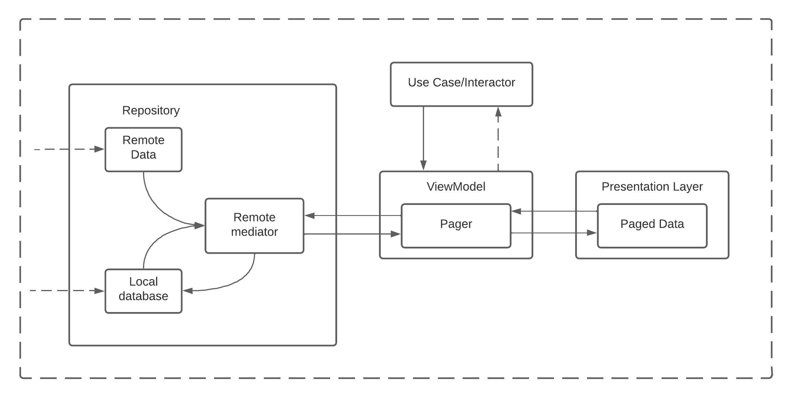

Katana Android App [Work in progress]
==================

# Features

Katana is an android applications that helps users to share their daily activities to another users.
Users can browse recent images, articles and other content. Users can also follow topics they are
interested in or follow specific user.

# Preview

    
    
    

# Architecture

About the katana app architecture: its layers, key classes and the interactions between them.

## Goals and requirements

The goals for the app architecture are:

* Follow the [official architecture guidance](https://developer.android.com/jetpack/guide) as
  closely as possible.
* Easy for developers to understand, nothing too experimental.
* Support multiple developers working on the same codebase.
* Minimize build times.

## Architecture overview

The app architecture has two layers:
a [data layer](https://developer.android.com/jetpack/guide/data-layer)
and [UI layer](https://developer.android.com/jetpack/guide/ui-layer).

The architecture follows a reactive programming model
with [unidirectional data flow](https://developer.android.com/jetpack/guide/ui-layer#udf). With the
data layer at the bottom, the key concepts are:

* Higher layers react to changes in lower layers.
* Events flow down.
* Data flows up.

# Modularization

## Overview

Modularization is the practice of breaking the concept of a monolithic, one-module codebase into
loosely coupled, self contained modules.

### Gradle plugin for modules

We use convention plugins in Katana application.

This approach is heavily based on [https://developer.squareup.com/blog/herding-elephants/](https://developer.squareup.com/blog/herding-elephants/)

By setting up convention plugins in `build-logic`, we can avoid duplicated build script setup, messy subproject configurations, without the pitfalls of the buildSrc directory.

Current list of convention plugins:
- [`katana.android.application`](build-logic/convention/src/main/kotlin/AndroidApplicationConventionPlugin.kt),
- [`katana.android.feature`](build-logic/convention/src/main/kotlin/AndroidFeatureConventionPlugin.kt),
- [`katana.android.library`](build-logic/convention/src/main/kotlin/AndroidLibraryConventionPlugin.kt),
- [`katana.android.test`](build-logic/convention/src/main/kotlin/AndroidTestConventionPlugin.kt)

### Benefits of modularization

This offers many benefits, including:

**Scalability** - In a tightly coupled codebase, a single change can trigger a cascade of
alterations. A properly modularized project will embrace
the [separation of concerns](https://en.wikipedia.org/wiki/Separation_of_concerns) principle. This
in turn empowers the contributors with more autonomy while also enforcing architectural patterns.

**Enabling work in parallel** - Modularization helps decrease version control conflicts and enables
more efficient work in parallel for developers in larger teams.

**Ownership** - A module can have a dedicated owner who is responsible for maintaining the code and
tests, fixing bugs, and reviewing changes.

**Encapsulation** - Isolated code is easier to read, understand, test and maintain.

**Reduced build time** - Leveraging Gradle’s parallel and incremental build can reduce build times.

**Dynamic delivery** - Modularization is a requirement
for [Play Feature Delivery](https://developer.android.com/guide/playcore/feature-delivery) which
allows certain features of your app to be delivered conditionally or downloaded on demand.

**Reusability** - Proper modularization enables opportunities for code sharing and building multiple
apps, across different platforms, from the same foundation.

## Modularization strategy

It’s important to note that there is no single modularization strategy that fits all projects.
However, there are general guidelines that can be followed to ensure you maximize its benefits and
minimize its downsides.

## Types of modules in Katana

The katana app contains the following types of modules:

* The `app` module - contains app level and scaffolding classes that bind the rest of the codebase,
  such as `MainActivity`, `KatanaApp` and app-level controlled navigation. The `app` module depends
  on all `feature` modules and required `core` modules.

* `feature-` modules - feature specific modules which are scoped to handle a single responsibility
  in the app. These modules can be reused by any app, including test or other flavoured apps, when
  needed, while still keeping it separated and isolated. If a class is needed only by one `feature`
  module, it should remain within that module. If not, it should be extracted into an
  appropriate `core` module. A `feature` module should have no dependencies on other feature
  modules. They only depend on the `core` modules that they require.

* `core-` modules - common library modules containing auxiliary code and specific dependencies that
  need to be shared between other modules in the app. These modules can depend on other core
  modules, but they shouldn't depend on feature nor app modules.

